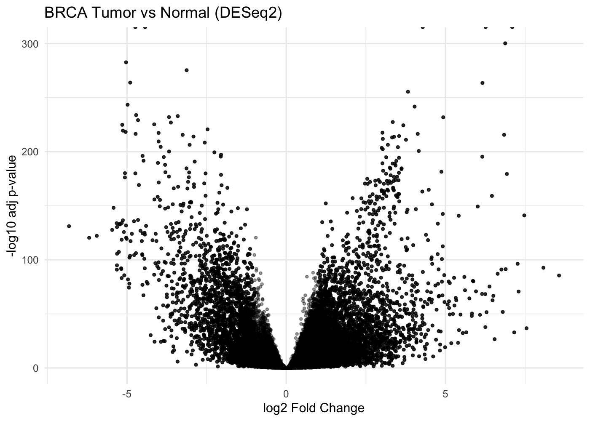
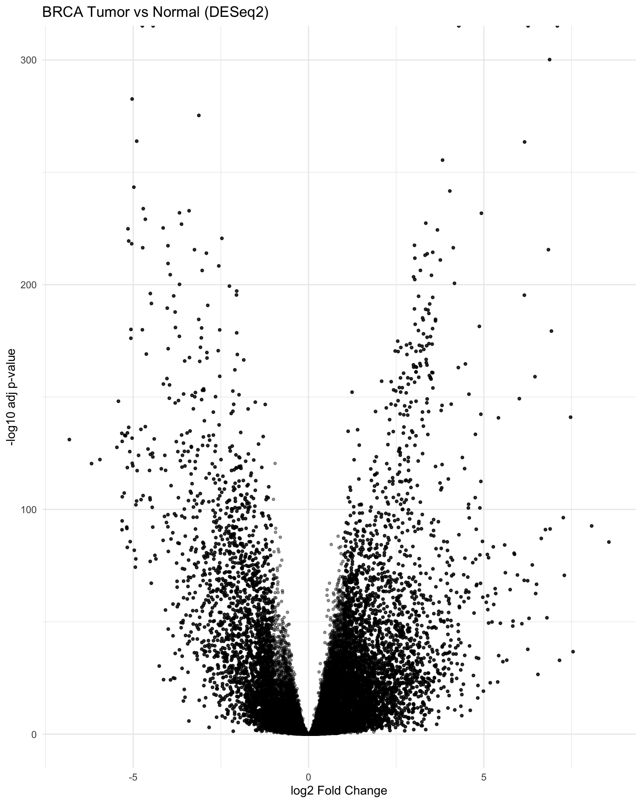
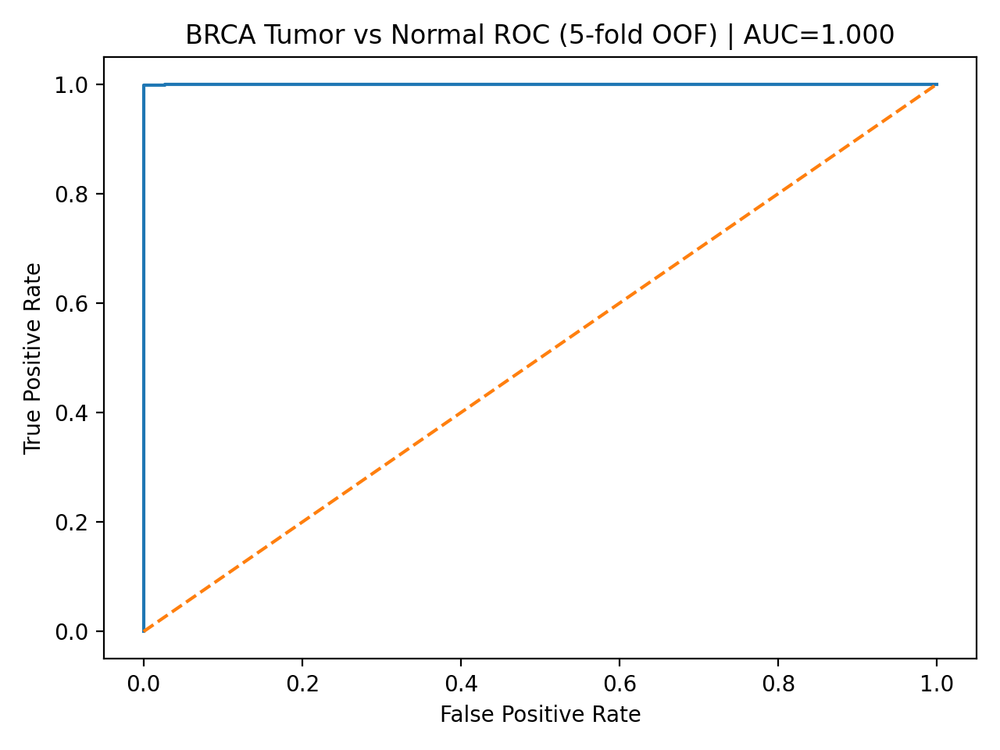
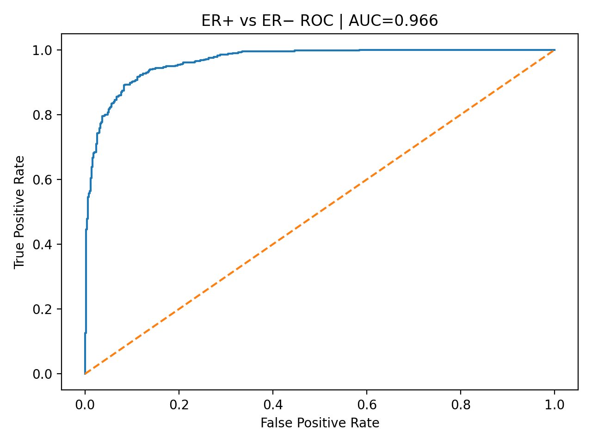

# Cancer RNA-seq ML: Breast Cancer Transcriptomics & Machine Learning

An end-to-end bioinformatics pipeline combining **differential expression analysis**, **pathway enrichment (GSEA)**, and **machine learning classification** on TCGA breast cancer (BRCA) RNA-seq data — moving from raw gene counts to biologically interpretable predictive models.

**Highlights:** 5,795 significant DE genes recovered · Hallmark GSEA confirming known BRCA biology · Logistic Regression tumor-vs-normal classifier (ROC-AUC ≈ 1.00) · ER+ vs ER− subtype classifier (ROC-AUC = 0.966) on a genuinely hard prediction task.



## Why this project

Most "cancer classification" ML demos skip straight to a gene-expression matrix and a classifier. This project instead follows the full biological workflow a computational biologist would actually use: raw counts → differential expression → pathway-level interpretation → feature-engineered ML → model interpretability — so that each modeling decision is grounded in the underlying biology rather than treated as a black box.

## Pipeline overview

| Stage | Method | Output |
|---|---|---|
| 1. Differential expression | DESeq2 (R) | 5,795 significant genes (padj < 0.05, \|log2FC\| > 1) |
| 2. Pathway enrichment | Hallmark GSEA (fgsea) | Proliferation (E2F/G2M/MYC) and estrogen-response programs enriched in tumors |
| 3. ML — Tumor vs Normal | Logistic Regression, top 200 DE genes, 5-fold CV | ROC-AUC = 0.9999 |
| 4. ML — ER+ vs ER− | Logistic Regression, ESR1/PGR excluded to avoid leakage, 5-fold CV | ROC-AUC = 0.966 |

## Key results

**Differential expression.** Tumor-upregulated genes were dominated by cancer-testis antigens (CSAG1, MAGEA6, MAGEA3) and stromal remodeling genes (COL10A1), while normal-enriched genes formed a coherent adipose/lipid metabolism signature (ADIPOQ, LEP, PLIN1) — consistent with normal breast tissue composition.



**Pathway-level biology.** Hallmark GSEA confirmed a dominant tumor proliferation signature (HALLMARK_E2F_TARGETS, NES = 2.41; HALLMARK_G2M_CHECKPOINT, NES = 2.33) alongside estrogen-response programs, while normal tissue was enriched for adipogenesis and fatty-acid metabolism — recovering canonical, textbook BRCA biology directly from the data.

**Tumor vs Normal classification.** Using the top 200 DE genes as features, a 5-fold cross-validated Logistic Regression classifier reached a near-perfect ROC-AUC of 0.9999 — expected for this comparatively "easy" task, since tumor and normal transcriptomes differ strongly.



**ER+ vs ER− classification (the harder, more clinically relevant task).** ER status was inferred from ESR1 expression (top/bottom 40%, n = 493 per group), and receptor genes were explicitly excluded from the features to prevent label leakage. The resulting classifier achieved a ROC-AUC of 0.966, showing that the model captures broader ER-associated transcriptional programs rather than trivial marker expression.



**Model interpretability.** Logistic Regression coefficients were extracted and mapped back to biology: tumor-associated weights aligned with extracellular matrix remodeling genes (SEMA5B, COL10A1, MMP11), while ER-negative (basal-like) tumors were characterized by mitotic and cytoskeletal remodeling genes (AURKB, KIF23, ADAMTS5) — showing the classifier learned coherent biological programs, not noise.

## Repository structure

```
cancer-rnaseq-ml/
├── environment.yml                 # Conda env: Python + R/Bioconductor (DESeq2, fgsea)
└── project1_ml_from_counts/
    ├── R/
    │   ├── 01_extract_brca_counts.R
    │   ├── 02_deseq2_brca.R         # Differential expression
    │   ├── 03_pathway_enrichment.R  # Hallmark GSEA
    │   └── 04_marker_boxplots.R
    ├── python/
    │   ├── 01_build_ml_matrix.py
    │   ├── 02_train_logreg_auc.py       # Tumor vs Normal classifier
    │   ├── 03_export_logreg_coeffs.py
    │   ├── 04_define_er_status.py
    │   ├── 05_build_er_ml_matrix.py
    │   ├── 06_train_er_logreg.py        # ER+ vs ER- classifier
    │   └── 07_export_er_logreg_coeffs.py
    ├── data/                        # Input data (not tracked)
    └── results/                     # Figures, tables, model outputs
```

## How to run

```bash
# 1. Set up the environment
conda env create -f environment.yml
conda activate cancer-rnaseq-ml

# 2. Differential expression & pathway analysis (R)
Rscript project1_ml_from_counts/R/02_deseq2_brca.R
Rscript project1_ml_from_counts/R/03_pathway_enrichment.R
Rscript project1_ml_from_counts/R/04_marker_boxplots.R

# 3. Tumor vs Normal ML classification (Python)
python project1_ml_from_counts/python/01_build_ml_matrix.py
python project1_ml_from_counts/python/02_train_logreg_auc.py
python project1_ml_from_counts/python/03_export_logreg_coeffs.py

# 4. ER+ vs ER- classification (Python)
python project1_ml_from_counts/python/04_define_er_status.py
python project1_ml_from_counts/python/05_build_er_ml_matrix.py
python project1_ml_from_counts/python/06_train_er_logreg.py
python project1_ml_from_counts/python/07_export_er_logreg_coeffs.py
```

All figures and tables are written to `project1_ml_from_counts/results/`.

## Tech stack

**R / Bioconductor:** DESeq2, fgsea, msigdbr, SummarizedExperiment, ggplot2
**Python:** pandas, numpy, scikit-learn, matplotlib
**Data:** TCGA-BRCA RNA-seq gene counts

## Author

**Ariss Alimi** — M.Sc. Bioinformatics, Université de Montréal
[GitHub](https://github.com/aral16)
